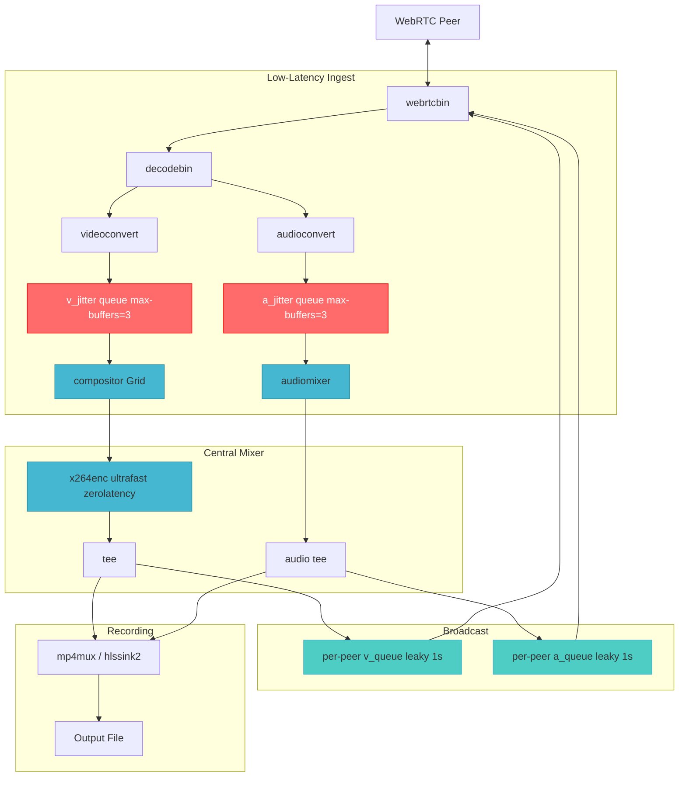
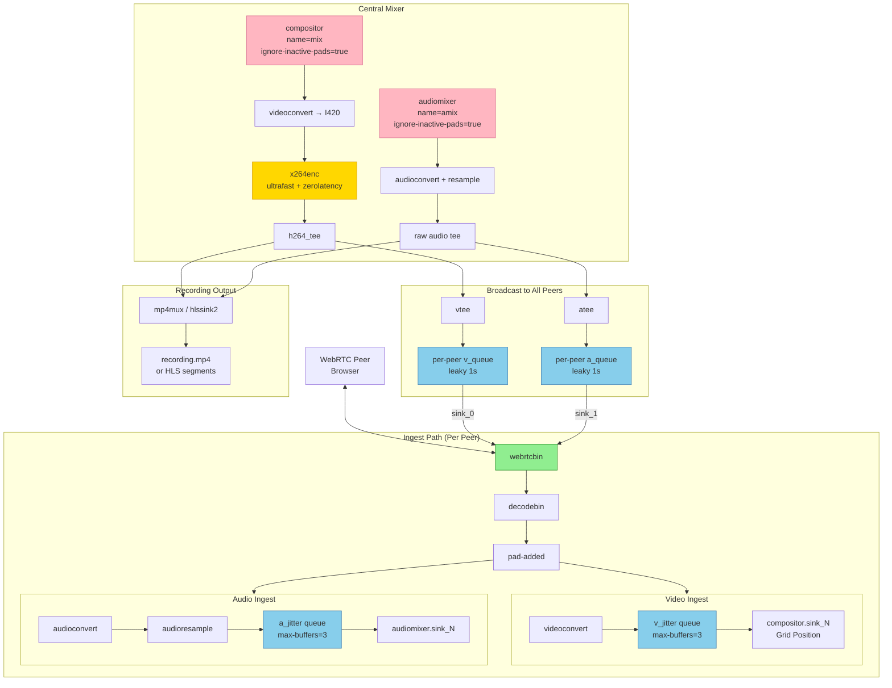

# GStreamer WebRTC MCU Media Compositor

This document provides a specification of the GStreamer-based Multipoint Control Unit (MCU)
implemented in `c_src/gst.c`. It defines the pipeline architecture, data structures,
dynamic peer lifecycle, inter-process communication protocol, output multiplexing strategies,
and architectural invariants of the production C99 compositor binary `priv/gst`.

## 1. Overview

The `gst` binary is a self-contained C99 process constituting the media plane
of the RTP video conferencing system. It fulfils three simultaneous responsibilities:

1. **Upstream Ingest** — Receives encrypted WebRTC SRTP/SRTCP streams from each
   participant via independent `webrtcbin` elements, decoding them into raw
   audio-visual frames using per-peer `decodebin` instances.
2. **Mixing and Compositing** — Composites all decoded video feeds into a single
   1920x1080 spatial grid via GStreamer's `compositor` and additively mixes
   all audio tracks through `audiomixer`.
3. **Downstream Broadcast and Recording** — Re-encodes and broadcasts the composite
   stream back to every participant as a single WebRTC downstream connection while
   simultaneously writing the session to disk in HLS or fragmented MP4 format.

The binary is spawned as a supervised OS port process by the Erlang
`rtp_broker` gen_server. All signaling is exchanged as newline-delimited
JSON over UNIX standard I/O pipes, making the media plane fully decoupled from
the Erlang control plane.





## 2. Data Structures

### 2.1 `PeerInfo` — Per-Participant Context Record

```c
typedef struct {
    gchar      *peer_id;      // Unique participant identifier string
    GstElement *webrtc;       // webrtcbin element (upstream + downstream)
    GstElement *v_queue;      // Leaky downstream video broadcast queue
    GstElement *a_queue;      // Leaky downstream audio broadcast queue
    GstPad     *comp_pad;     // Requested compositor sink pad (retained for cleanup)
    GstPad     *amix_pad;     // Requested audiomixer sink pad (retained for cleanup)
    GstElement *v_decodebin;  // Dynamically attached video decodebin
    GstElement *a_decodebin;  // Dynamically attached audio decodebin
    GstElement *v_convert;    // videoconvert inserted between decodebin and compositor
    GstElement *a_convert;    // audioconvert inserted before audioresample
    GstElement *a_resample;   // audioresample normalizing sample rate to 48 kHz
    gint        grid_idx;     // Grid slot index [0..15] controlling spatial position
} PeerInfo;
```

`PeerInfo` aggregates every GStreamer element and requested pad dynamically created
on peer join, enabling deterministic full cleanup on departure. All instances are
stored in a `GHashTable` keyed by `peer_id` with value destructor `free_peer_info`.

### 2.2 `RecorderState` — Singleton Pipeline State

```c
typedef struct {
    GstElement  *pipeline;
    GstElement  *compositor;     // Video compositing mixer (name="mix")
    GstElement  *audiomixer;     // Audio mixing element (name="amix")
    GstElement  *video_tee;      // Broadcast video tee (name="vtee")
    GstElement  *audio_tee;      // Broadcast audio tee (name="atee")
    GHashTable  *webrtcbins;     // peer_id -> PeerInfo*
    GMainLoop   *loop;
    gboolean     grid_slots[16]; // Spatial slot occupancy bitmap (up to 4x4)
    gint         pad_index;      // Global compositor pad counter
} RecorderState;
```

`RecorderState` is a process-global singleton. References to the four permanent
pipeline elements are resolved by name after `gst_parse_launch()` and cached
for O(1) dynamic peer attachment.

## 3. Static Pipeline Topology

The persistent portion of the pipeline is constructed once at startup via
`gst_parse_launch()`. Three variants are supported, selected by the second CLI argument.

### 3.1 HLS/H.264 (Default `ts` format)

```
videotestsrc pattern=black is-live=true !
  timeoverlay ! video/x-raw,width=1920,height=1080,framerate=30/1 ! mix.sink_0

audiotestsrc is-live=true volume=0 ! amix.sink_0

compositor name=mix ignore-inactive-pads=true !
  videoconvert !
  video/x-raw,format=I420,width=1920,height=1080,framerate=30/1 !
  x264enc bitrate=4000 speed-preset=ultrafast key-int-max=60 tune=zerolatency !
  video/x-h264,profile=baseline ! h264parse ! tee name=h264_tee

h264_tee. ! queue leaky=2 max-size-buffers=1 ! rtph264pay pt=96 ! tee name=vtee
h264_tee. ! queue leaky=2 max-size-time=30000000000 ! hlssink2.video

audiomixer name=amix ignore-inactive-pads=true !
  audioconvert ! audioresample ! audio/x-raw,rate=48000,channels=2 ! tee name=raw_atee

raw_atee. ! queue leaky=2 ! opusenc ! rtpopuspay pt=111 ! tee name=atee
raw_atee. ! queue leaky=2 max-size-time=30000000000 !
  audioconvert ! audioresample ! audio/x-raw,rate=44100,channels=2 !
  avenc_aac ! aacparse ! hlssink2.audio

hlssink2 name=hlssink2
  location=<out_dir>/segment_<ts>_%05d.ts
  playlist-location=<out_dir>/index.m3u8
  target-duration=2 max-files=0 playlist-length=10
```

### 3.2 Fragmented MP4 (`fmp4` / `mp4`)

Identical upstream compositing graph; HLS sink replaced by:

```
mp4mux name=mux fragment-duration=1000 streamable=true !
  filesink location=<out_dir>/recording.mp4

h264_tee. ! queue leaky=2 max-size-time=30000000000 ! mux.video_0
raw_atee. ! queue leaky=2 max-size-time=30000000000 !
  audioconvert ! audioresample ! audio/x-raw,rate=44100,channels=2 !
  avenc_aac ! aacparse ! mux.audio_0
```

### 3.3 HEVC/HLS (`hevc` / `h265`)

Dual-encoding via `raw_vtee`: H.264 for WebRTC participants; H.265 for HLS storage.
Audio follows the same `raw_atee` bifurcation.

### 3.4 Invariant Bootstrap Sources

A live black `videotestsrc` on `mix.sink_0` (zorder=1) and a silent `audiotestsrc`
on `amix.sink_0` are permanently active. They prevent scheduler stalls when no peers
are connected and allow dynamic peer sources to preroll instantaneously.

## 4. Dynamic Peer Lifecycle

### 4.1 Peer Join — `setup_peer(peer_id)`

Six ordered operations on receipt of `{"type":"peer_joined","peer_id":"..."}`:

1. **Grid slot allocation**: Scans `state.grid_slots[0..15]` for the first free slot.
2. **`webrtcbin` creation**: Named element with 50 ms latency budget.
3. **Leaky broadcast queue creation**: `leaky=2`, `max-size-time=1000000000` (1 s).
4. **Downstream broadcast linkage**: `vtee -> v_queue -> webrtcbin.sink_0`; `atee -> a_queue -> webrtcbin.sink_1`.
5. **State synchronization**: `gst_element_sync_state_with_parent()` on all added elements.
6. **SDP offer generation**: Asynchronous `GstPromise` triggers `on_offer_created`.

### 4.2 Incoming RTP Track Routing — `on_incoming_pad`

```c
const gchar *media = gst_structure_get_string(str, "media");
gboolean is_video = (g_strcmp0(media, "video") == 0);
```

A `decodebin` is linked to the RTP pad; decoded pads trigger `on_decoded_pad`.

### 4.3 Decoded Pad Routing — `on_decoded_pad`

**Video path** — compositor quadrant placement:

```c
GstPad *comp_pad = gst_element_request_pad_simple(state.compositor, "sink_%u");
peer->comp_pad = comp_pad;

gint idx = peer->grid_idx;
gint w = WIDTH / 2;   // 960
gint h = HEIGHT / 2;  // 540
gint x = (idx % 2) * w;
gint y = (idx / 2) * h;

g_object_set(comp_pad, "xpos", x, "ypos", y, "width", w, "height", h,
             "zorder", (guint)(idx + 10), "sizing-policy", 1, NULL);
```

**Audio path**: `audioconvert -> audioresample -> audiomixer.sink_%u`.

### 4.4 Peer Departure — Six-Stage Teardown `cleanup_peer(peer_id)`

| Stage | Action |
|-------|--------|
| 1 | Unlink/release vtee src pad; NULL v_queue; remove from pipeline |
| 2 | Unlink/release atee src pad; NULL a_queue; remove from pipeline |
| 3 | Unlink from comp_pad; release compositor pad; NULL/remove v_convert, v_decodebin |
| 4 | Unlink from amix_pad; release audiomixer pad; NULL/remove a_resample, a_convert, a_decodebin |
| 5 | NULL webrtcbin; remove from pipeline |
| 6 | Free grid slot; remove from webrtcbins hash table |

## 5. Signaling Protocol (Port IPC)

Newline-delimited JSON over UNIX stdio. Stdin messages are processed synchronously
on the GLib main loop via `g_io_add_watch`, serializing all pipeline mutations.

### 5.1 Erlang to GStreamer (stdin)

| Type | Fields | Effect |
|---|---|---|
| `peer_joined` | `peer_id` | Triggers `setup_peer()` |
| `sdp_answer` | `peer_id`, `sdp` | Sets remote description on webrtcbin |
| `ice_candidate` | `peer_id`, `candidate.sdpMLineIndex`, `candidate.candidate` | Adds ICE candidate |
| `peer_left` | `peer_id` | Triggers six-stage `cleanup_peer()` |
| `exit` | — | Sends EOS to mux; finalizes recording |

### 5.2 GStreamer to Erlang (stdout)

| Type | Fields | Effect |
|---|---|---|
| `sdp_offer` | `peer_id`, `sdp` | Forwarded by broker to browser via Syn |
| `ice_candidate` | `peer_id`, `candidate` | Forwarded to browser |
| `recording_started` | — | Pipeline reached PLAYING state |

## 6. Output Delivery Nuances

### 6.1 PTS/DTS Integrity

HLS tees after `h264parse`, before `rtph264pay`. RTP payload/depayload cycles
corrupt timestamps; `mpegtsmux` is intolerant of discontinuities and MSE decoders
freeze permanently after the first affected segment.

### 6.2 Disk-I/O Isolation

30-second leaky queues (`max-size-time=30000000000`) on storage branches absorb
filesystem stalls, guaranteeing HLS/MP4 continuity independent of disk I/O jitter.

### 6.3 Fragmented MP4

`mp4mux fragment-duration=1000 streamable=true` interleaves `moof`/`mdat` atoms,
enabling progressive download and crash-resilient playback without a terminal `moov`.

### 6.4 HEVC Dual-Encode

`raw_vtee` drives separate `x264enc` (WebRTC) and `x265enc` (HLS) encoder chains,
providing H.265 fidelity for capable clients without breaking WebRTC compatibility.

## 7. Signal Handling and Graceful Shutdown

```c
// g_unix_signal_add dispatches safely on the GLib main loop
GstElement *mux = gst_bin_get_by_name(GST_BIN(state.pipeline), "mux");
if (mux) {
    gst_element_send_event(mux, gst_event_new_eos());
    gst_object_unref(mux);
}
```

The muxer finalizes index structures before the loop quits on bus EOS.

## 8. Build and Evaluation

### 8.1 Dependencies (macOS)

```bash
brew install gstreamer libnice libnice-gstreamer json-glib
```

### 8.2 Dependencies (Ubuntu / WSL2)

```bash
sudo apt-get update
sudo apt-get install -y libgstreamer1.0-dev libgstreamer-plugins-base1.0-dev libgstreamer-plugins-bad1.0-dev libjson-glib-dev pkg-config
```

In PowerShell allow UDP traffic:

```
New-NetFirewallRule -DisplayName "RTP WebRTC Media UDP (WSL2)" -Direction Inbound -Action Allow -Protocol UDP -LocalPort 49152-65535
```

In `gst.c`:

```
g_object_set(webrtc, "latency", 50, "stun-server", "stun://stun.l.google.com:19302", NULL);
```

### 8.3 Compile

```bash
cc -O3 c_src/gst.c -o priv/gst \
  $(pkg-config --cflags --libs \
    gstreamer-1.0 gstreamer-webrtc-1.0 gstreamer-sdp-1.0 json-glib-1.0)
```

### 8.4 Standalone Test

```bash
mkdir -p /tmp/rtp-test && ./priv/gst /tmp/rtp-test ts
```

### 8.5 Launch via Erlang Node

```bash
iex -S mix
# http://localhost:8081/app/login.htm
```

### 8.6 Mock Devices

**Chrome**: `--use-fake-device-for-media-stream --use-fake-ui-for-media-stream`
**Safari**: Develop -> WebRTC -> Use Mock Capture Devices

## 9. Architectural Invariants

| Invariant | Mechanism |
|---|---|
| Continuous pipeline flow | `videotestsrc` + `audiotestsrc` on compositor/audiomixer `sink_0` |
| Thread-safe pipeline mutation | All mutations on GLib main loop via IO channel watch |
| Back-pressure isolation | Per-peer leaky queues (`leaky=2`, `max-size-time=1s`) |
| Z-order correctness | Background `zorder=1`; peers `zorder = grid_idx + 10` |
| PTS/DTS integrity | Tees after `h264parse`, before `rtph264pay` |
| Crash-resilient MP4 | `mp4mux streamable=true fragment-duration=1000` |
| Disk-I/O isolation | 30-second leaky queues on HLS/MP4 storage branches |
| Signal safety | `g_unix_signal_add()` dispatches to GLib main loop |
| Resource reclamation | Six-stage ordered cleanup on every peer departure |
| Grid capacity | Up to 16 simultaneous participants (4x4 spatial grid) |
