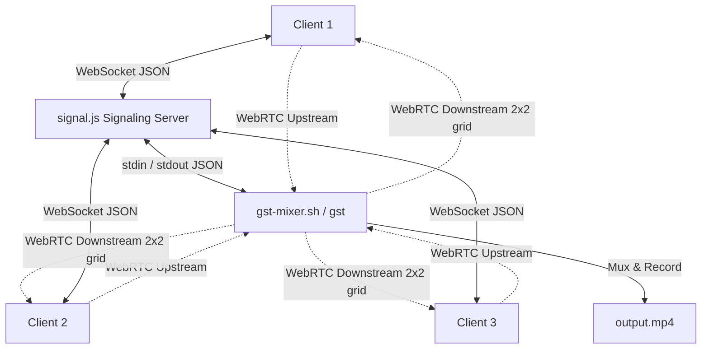

# GStreamer WebRTC MCU Video Conferencing Gateway

This document provides detailed documentation for the GStreamer-based WebRTC Multi-point Control Unit (MCU) video conferencing gateway. It covers the system architecture, file roles, core implementation logic (in C, Node.js, and HTML5/JS), and instructions for local evaluation.

---

## 1. Intro

The WebRTC MCU is a high-performance video conferencing gateway designed to:
* **Composite multiple upstream video feeds** from client webcams into a single, combined $2 \times 2$ grid layout.
* **Mix all upstream audio tracks** into a single audio output channel.
* **Broadcast the combined video and audio streams** back to all connected client browsers as a single WebRTC downstream connection.
* **Record the conference locally** in a standard, playable MP4 container (`output.mp4`) with crash-resilient metadata recovery.

### Component Map
1. **GStreamer C Mixer (`c_src/gst.c` & `gst-mixer.sh`)** – The core media engine that handles RTP payloads, decodes inputs, manages compositor layers, broadcasts downstream tracks, and records the conference.
2. **Node.js Signaling & Web Server (`signal.js`)** – A static web server and WebSocket signaling bridge that manages client sessions and pipes JSON signaling messages to/from GStreamer's `stdin`/`stdout`.
3. **HTML5 Client (`mcu.html`)** – A responsive, glassmorphic WebRTC browser client that captures local webcam/mic media, displays the remote composite grid, and manages signaling negotiations.

---

## 2. Architecture

The system utilizes a central server architecture that acts as a media multiplexer and finalizer.



### Core Architectural Patterns
* **Continuous Active Sources**: To prevent GStreamer pipeline deadlocks during dynamic state transitions, a live black video stream (`videotestsrc`) and silent audio stream (`audiotestsrc`) are established at startup on pad `sink_0` of the compositor and audiomixer. This keeps media buffers flowing continuously, ensuring that dynamic peers can preroll instantly.
* **Loop Decoupling**: Since each peer's `webrtcbin` acts as both a source (receiving raw tracks) and a sink (sending the mixed grid), GStreamer's scheduler detects a loop in the pipeline. We introduce independent `queue` elements with **leaky downstream** configuration on every broadcast branch to decouple processing threads and isolate network congestion.
* **Explicit Layering (Z-Ordering)**: The compositor uses explicit z-orders on its input pads. The background black source is set to `zorder = 1`, and newly connected dynamic peer tracks are assigned `zorder = idx + 10` (e.g., `11`, `12`...). This ensures peer videos are layered on top of the black canvas rather than behind it.
* **Thread-Safe Unix Signal Handling**: Raw C signal handlers are not async-signal-safe. We use GLib's `g_unix_signal_add` on the GLib event loop context to capture termination signals (`SIGINT`/`SIGTERM`) safely, propagating a targeted End-Of-Stream (`EOS`) event exclusively to the recording muxer.

---

## 3. Implementation (Detailed Code Explanation)

### A. Peer Context Tracking
Instead of tracking only the WebRTC element, a structured `PeerInfo` context is declared to associate all dynamically created elements and requested pads for clean memory cleanup:

```c
typedef struct {
    gchar *peer_id;
    GstElement *webrtc;
    GstElement *v_queue;
    GstElement *a_queue;
    GstPad *comp_pad;
    GstPad *amix_pad;
    GstElement *v_decodebin;
    GstElement *a_decodebin;
    GstElement *v_convert;
    GstElement *a_convert;
    GstElement *a_resample;
} PeerInfo;
```

These contexts are stored in a global GLib HashTable inside `RecorderState`:
```c
state.webrtcbins = g_hash_table_new_full(g_str_hash, g_str_equal, g_free, free_peer_info);
```

### B. Setup Peer & Decoupling Queues
When a peer joins, `setup_peer(peer_id)` creates the `webrtcbin` and its broadcast queues. We configure `leaky=2` (drop oldest buffers) and `max-size-buffers=60` on the queues to isolate client lag:

```c
peer->v_queue = gst_element_factory_make("queue", vqueue_name);
peer->a_queue = gst_element_factory_make("queue", aqueue_name);

g_object_set(peer->v_queue, "leaky", 2, "max-size-buffers", 60, NULL);
g_object_set(peer->a_queue, "leaky", 2, "max-size-buffers", 60, NULL);
```

### C. Track Detection (RTP Parsing)
Incoming WebRTC pads output RTP packets (`application/x-rtp`). Rather than parsing the structure name, we extract the `"media"` string field to accurately differentiate video and audio:

```c
GstCaps *caps = gst_pad_get_current_caps(pad);
const GstStructure *str = gst_caps_get_structure(caps, 0);
const gchar *media = gst_structure_get_string(str, "media");
gboolean is_video = (g_strcmp0(media, "video") == 0);
```

### D. Grid Coordinates & Layering
In `on_decoded_pad`, when raw video is produced, we request a compositor pad, calculate the quadrant offsets using `pad_index`, and configure the explicit z-order:

```c
GstPad *comp_pad = gst_element_request_pad_simple(state.compositor, "sink_%u");
peer->comp_pad = comp_pad;

gint idx = state.pad_index++;
gint w = WIDTH / 2;
gint h = HEIGHT / 2;
gint x = (idx % 2) * w;
gint y = (idx / 2) * h;

g_object_set(comp_pad, "xpos", x, "ypos", y, "width", w, "height", h, "zorder", (guint) (idx + 10), NULL);
```

### E. Peer Disconnection Cleanup
When a peer disconnects, `cleanup_peer(peer_id)` systematically releases requested pads and removes dynamic elements:

```c
// Release compositor pad and remove videoconvert
if (peer->comp_pad) {
    gst_element_release_request_pad(state.compositor, peer->comp_pad);
    gst_object_unref(peer->comp_pad);
}
if (peer->v_convert) {
    gst_element_set_state(peer->v_convert, GST_STATE_NULL);
    gst_bin_remove(GST_BIN(state.pipeline), peer->v_convert);
}
```

### F. Crash-Resilient Recording
To ensure the recorded MP4 is always playable, `mp4mux` is initialized with reserved header structures and periodic updates directly on disk:

```c
"mp4mux name=mux reserved-max-duration=3600000000000 reserved-moov-update-period=1000000000 ! filesink location=%s"
```
* `reserved-max-duration` allocates space for the `moov` atom header at the beginning of the file for a 1-hour recording.
* `reserved-moov-update-period` synchronizes the `moov` index tables to disk once every second. Even if the process is terminated forcefully (`kill -9`), the file remains valid and playable.

---

## 4. Evaluation (Setup and Run Video Conference)

### 1. Install Dependencies
Install GStreamer, the nice plugins (ICE support), and Node.js on macOS:
```bash
brew install gstreamer libnice libnice-gstreamer node
```

### 2. Compile the Mixer Binary
Build the GStreamer recorder binary using `pkg-config`:
```bash
cc -O3 c_src/gst.c -o priv/gst $(pkg-config --cflags --libs gstreamer-1.0 gstreamer-webrtc-1.0 gstreamer-sdp-1.0 json-glib-1.0)
```

### 3. Launch the Signaling & Web Server
Run the signaling monolith:
```bash
node signal.js
```
The server will start listening at `http://localhost:8888`.

### 4. Connect WebRTC Clients
To test a multi-stream layout locally on a single machine:

* **Safari Mock Mode**:
  1. Open Safari -> Go to **Settings** -> **Advanced** -> Enable **"Show features for web developers"**.
  2. Select **Develop** menu -> **WebRTC** -> Enable **"Use Mock Capture Devices"**.
  3. Open 3 Safari tabs to `http://localhost:8888` and click **Join Conference** in each.
* **Chrome Fake Media Mode**:
  Open Chrome from your terminal with mock device parameters:
  ```bash
  open -a "Google Chrome" --args --use-fake-device-for-media-stream --use-fake-ui-for-media-stream http://localhost:8888
  ```
  Open multiple tabs and click **Join Conference**.

### 5. Finalize and Stop
Send an interrupt signal to cleanly close the session and finalize `output.mp4`:
```bash
kill -INT $(pgrep -f "node signal.js")
```

### 6. Verify Recorded Video
Inspect the generated `output.mp4` using `ffprobe` to verify tracks and duration:
```bash
ffprobe output.mp4
```

---

## 5. Conclusion

The GStreamer WebRTC MCU video gateway prototype provides a robust, low-latency layout compositing solution.
* **Layering & Z-Ordering** ensures that dynamic feeds are positioned in quadrants and layered on top of the black canvas background.
* **Leaky Queues** prevent lagging or disconnected peers from deadlocking the rest of the conference.
* **Clean State Transitions & Destructors** systematically reclaim CPU and memory resources upon peer disconnection.
* **Crash-Resilient Muxing** guarantees media finalization safety under unexpected network dropouts or SIGKILL actions.
