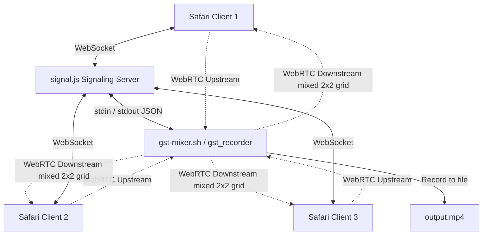

# GST.md

## Overview

The GStreamer MCU implementation lives in **`c_src/gst.c`**. Its purpose is to receive WebRTC streams from multiple peers, decode them, and compose them into a single video recording (MP4). The code arranges the video streams in a **2 × 2 grid** (four quadrants) and mixes all audio into a single track.

---

## Where the list of streams is stored

### 1. Peer‑to‑WebRTC element map (`state.webrtcbins`)

```c
static RecorderState state;
...
state.webrtcbins = g_hash_table_new_full(g_str_hash,
                                          g_str_equal,
                                          g_free,
                                          g_object_unref);
```

- **Key** – `peer_id` (a `gchar*` supplied by the Erlang side).
- **Value** – the `GstElement*` created for that peer (`webrtcbin`).
- This hash table lives in the global `RecorderState` struct and is populated in **`setup_peer()`**:
  ```c
  g_hash_table_insert(state.webrtcbins, g_strdup(peer_id), webrtc);
  ```
- It is the authoritative list of *active* peers. When a peer leaves you would remove the entry (the current file does not contain explicit removal code).

### 2. Pad index counter (`state.pad_index`)

```c
state.pad_index = 0;   // initialised in main()
```

Every time a **video pad** is decoded (`on_decoded_pad`), the function increments `state.pad_index` and uses the value to calculate the grid cell:

```c
gint idx = state.pad_index++;   // 0‑based index for the incoming video stream
```

- The counter provides a **stable ordering** of the streams as they appear on the compositor.
- It is not a container of the streams themselves; it merely supplies a sequential number used for positioning.

### 3. Grid placement logic (inside `on_decoded_pad`)

```c
gint w = WIDTH  / 2;          // cell width  – half of full width
gint h = HEIGHT / 2;          // cell height – half of full height
gint x = (idx % 2) * w;       // column → X offset
gint y = (idx / 2) * h;       // row    → Y offset

g_object_set(comp_pad,
             "xpos",   x,
             "ypos",   y,
             "width",  w,
             "height", h,
             NULL);
```

- `comp_pad` is a sink pad on the **`compositor`** element (`state.compositor`).
- The geometry values tell the compositor where to draw the incoming video frame.
- Because `idx` comes from `state.pad_index`, the placement order directly reflects the order in which streams were first seen.

---

## Summary of data structures

| Structure | Purpose | Key fields used for stream handling |
|-----------|---------|-------------------------------------|
| `RecorderState` (global) | Holds the entire MCU state. | `webrtcbins` (hash table), `pad_index` (counter), `pipeline`, `compositor`, `audiomixer`, `video_tee`, `audio_tee`, `loop` |
| `state.webrtcbins` | Maps *peer id* → *webrtcbin element*. | `peer_id` strings are the unique identifiers provided by Erlang. |
| `state.pad_index` | Simple integer counter used to assign grid cells. | Incremented for each decoded **video** pad. |
| `state.compositor` | GStreamer compositor element (`compositor name=mix`). | Receives sink pads (`sink_%u`) whose geometry is set per stream. |

---

## How the flow works

1. **Signalling** – Erlang sends a JSON message (`peer_joined`) → `handle_signaling_message` → `setup_peer(peer_id)`.
2. `setup_peer` creates a `webrtcbin` for the peer, stores it in `state.webrtcbins`, and fires an SDP offer.
3. When the remote peer sends media, the `pad-added` signal on the webrtcbin triggers `on_incoming_pad`.
4. `on_incoming_pad` creates a `decodebin`, links the incoming pad to it, and connects the `pad-added` signal of the decodebin to `on_decoded_pad`.
5. **Video** – `on_decoded_pad` receives the decoded video pad, requests a compositor sink pad, calculates `x`, `y`, `w`, `h` using `state.pad_index`, and links the pipeline.
6. **Audio** – a similar path sends the audio pads to the `audiomixer` (no grid logic required).
7. The compositor (with its positioned pads) and the audio mixer feed into the MP4 muxer for recording.

---

## Extending the grid

If you need more than four video streams, you can:
- Increase the grid dimensions (e.g., `cols = 3`, `rows = 2`).
- Compute `w = WIDTH / cols; h = HEIGHT / rows;` and adjust the `x`/`y` formulas accordingly.
- Optionally clamp `idx` so that streams beyond the grid are either discarded or placed in an overflow area.

---

## References in the source code

- **Peer map creation** – `setup_peer()` (lines ~96‑111).
- **Grid layout** – `on_decoded_pad()` (lines ~226‑247).
- **Global state definition** – top of `gst.c` (lines ~14‑25).

---

*This document is intended to be added to the repository as documentation for developers working on the GStreamer MCU component.*

---

## GStreamer WebRTC MCU Video Conferencing MVP

This section describes the minimal viable prototype (MVP) of the GStreamer WebRTC MCU video conferencing gateway, using a three-tier design:
1. **GStreamer C Mixer (`c_src/gst.c`)**
2. **Node.js Signaling & Web Server (`signal.js`)**
3. **HTML5 WebRTC Client (`mcu.html`)**

### 1. Architecture



* **Continuous Live Mixing Feed**: The compositor uses a background black video stream (`videotestsrc`) and silence (`audiotestsrc`) on index `sink_0` to keep the pipeline continuously active (avoiding dynamic preroll deadlocks).
* **Grid Layout Placement**: Peer streams are dynamically assigned grid positions starting at index `1` (`sink_1`, `sink_2`, `sink_3`), filling the top-right, bottom-left, and bottom-right sectors of the 1920x1080 canvas.
* **Bi-directional Downstream**: The composite mixed grid and mixed audio are payloaded once, tee'd, and broadcasted back to all peers via their `webrtcbin` connections.
* **Local Recording**: The RTP packets of the composite stream are depayloaded, parsed, and muxed into a local MP4 file (`output.mp4`).

### 2. File Roles and Implementations

#### A. C Mixer ([c_src/gst.c](file:///Users/tonpa/depot/zencrypted/rtp/c_src/gst.c) & [gst-mixer.sh](file:///Users/tonpa/depot/zencrypted/rtp/gst-mixer.sh))
* Dynamic peer setups are signaled on `stdin` using JSON lines:
  * `{"type": "peer_joined", "peer_id": "..."}`
  * `{"type": "sdp_answer", "peer_id": "...", "sdp": "..."}`
  * `{"type": "ice_candidate", "peer_id": "...", "candidate": {...}}`
* Outputs SDP offers and ICE candidates on `stdout`:
  * `{"type": "sdp_offer", "peer_id": "...", "sdp": "..."}`
  * `{"type": "ice_candidate", "peer_id": "...", "candidate": {...}}`
* All debug output is routed to `stderr` to prevent stdout contamination.

#### B. Signaling & Web Monolith ([signal.js](file:///Users/tonpa/depot/zencrypted/rtp/signal.js))
* Serves `mcu.html` on `http://localhost:8888` (so that Safari can grant camera/mic permissions on a secure origin).
* Manages the life cycle of the `gst-mixer.sh` child process.
* Directs and translates WebSocket JSON messages to/from GStreamer's standard streams.

#### C. HTML5 Client ([mcu.html](file:///Users/tonpa/depot/zencrypted/rtp/mcu.html))
* A responsive, glassmorphic dark theme built for modern video conferencing layouts.
* Obtains user media (microphone and camera) and registers local tracks in the RTCPeerConnection before signaling `ready`.
* Negotiates incoming WebRTC offers from the MCU, replies with SDP answers, and exchanges ICE candidates dynamically.

### 3. Compilation and Execution

1. **Verify dependencies** (GStreamer 1.20+ and the Nice plugin):
   ```bash
   brew install gstreamer libnice libnice-gstreamer
   ```
2. **Start the Signaling & Web Server**:
   ```bash
   node signal.js
   ```
3. **Connect Clients**:
   Open 3 Safari tabs or windows to `http://localhost:8888`.
   * Grant camera & microphone access.
   * Click **Join Conference** in all tabs.
4. **Finalize Recording**:
   Stop the Node server with `Ctrl+C` (sending `SIGINT`). This executes the following safety measures:
   * **Targeted Unix Signal Handler**: The C mixer intercepts unix signals (`SIGINT`/`SIGTERM`) safely using `g_unix_signal_add` on the GLib event loop thread. It sends an `EOS` event specifically to the `mp4mux` element (`mux`), which propagates it to `filesink` to write the standard MP4 trailer/header index.
   * **Crash-Resilience Fallback**: `mp4mux` is configured with `reserved-max-duration` (supporting 1 hour) and `reserved-moov-update-period` (1 second). This reserves header space and writes index frames directly to the file every second, guaranteeing that `output.mp4` is always valid and playable even if the server crashes or is forcefully terminated (`kill -9`).

