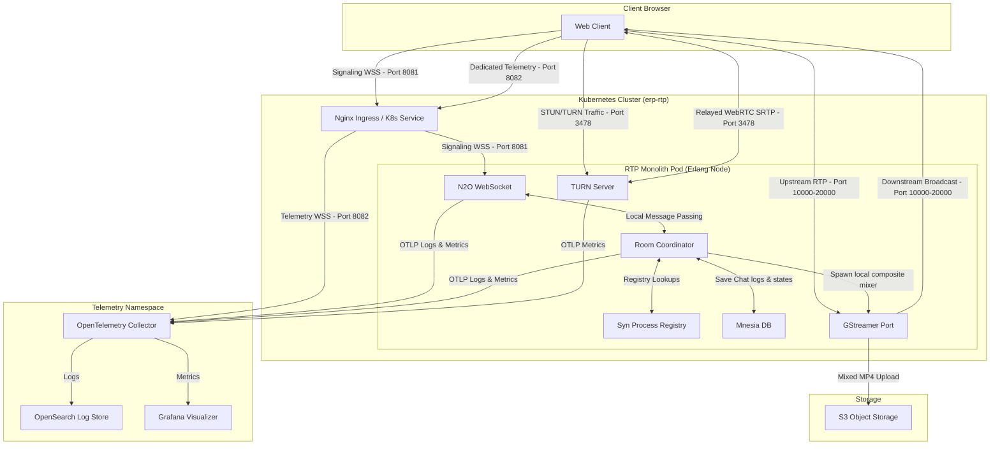

# WebRTC Group Video Conference HPA Server

This repository contains the unified, lightweight RTP monorepo designed for high-performance WebRTC
video conferencing in the SYNRC CHAT environment. It consolidates N2O WebSocket pages,
room process supervisors, Mnesia persistence, and in-process GStreamer mixer port drivers
into a single cohesive Erlang/OTP application.

## 1. Directory Blueprint

```
├── c_src/
│   └── gst.c                    # GStreamer WebRTC compositor C99 implementation
├── config/
│   ├── config.exs               # Elixir Erlang/OTP Application Environment
│   ├── sys.config               # Database directory, Eturnal TCP/UDP listeners, and N2O parameters
│   └── vm.args                  # Cluster node cookie and naming args
├── priv/
│   ├── static/                  # Front-end dashboard and client scripts
│   │   ├── app/                 #
│   │   │   ├── index.html       # INDEX.HTML Page
│   │   │   └── login.html       # LOGIN.HTML Page
│   │   └── rtp.css              # RTP.CSS Styles
│   └── gst                      # compiled native C99 binary spawned by Erlang port
├── lib/
│   └── rtp
│       ├── live_stream.ex       # HTTP Live Streaming (HLS) Server
│       ├── n2o_socket.ex        # N2O Bandit WebSocket Proxy
│       ├── static.ex            # Static Server
│       └── ws.ex                # WebSocker Server
├── src/
│   ├── index.erl                # N2O Nitro room chat history feed
│   ├── login.erl                # N2O Nitro user session handler
│   ├── media_broker_srv.erl     # supervised GStreamer compositor port manager (mp4 to S3 storage)
│   ├── mnesia_srv.erl           # local database schema setup (disc_copies chat and room tables)
│   ├── n2o_signaling.erl        # WebRTC SDP/ICE
│   ├── room_coordinator.erl     # Main Gen Server
│   ├── routes.erl               # Erlang/OTP Default Routes
│   ├── rtp_app.erl              # Erlang/OTP Application
│   ├── rtp_sup.erl              # Erlang/OTP Supervisor starting mnesia_srv and media_broker_srv workers
│   ├── rtp_syn.erl              # RTP Pub/Sub (Redis replacement)
│   ├── rtp.app.src              # Deps: [kernel, stdlib, inets, ssl, bandit, websock_adapter, n2o, nitro, kvs, syn, mnesia]
│   └── session_token.erl
├── mix.exs                      # Elixir Packages (Dependencies)
├── gst-nuttx.pdf                # GStreamer MCU port to NuttX
├── rtp.pdf                      # GStreamer MCU Article in LaTeX
├── GST.md                       # GStreamer MCU
└── README.md                    # This file
```

## 2. Unified Architecture Topology

The simplified architecture integrates all real-time messaging, orchestration, database persistence,
and TURN capabilities into a single monolithic Erlang node, delegating layout composting and recordings
directly to local GStreamer port processes.



## 3. Technical Features

* **Zero Headless Browsers**:     Recording and compositing grid layouts is done using native GStreamer compositor port
                                  pipelines instead of Chromium-based egress, reducing resource footprint by over 90%.
* **Erlang Process Pub/Sub**:     Redis is completely removed. Signaling groups are managed in-memory across Erlang
                                  cluster nodes using Roberto Ostinelli's **`syn`** registry.
* **Persistent Mnesia Engine**:   Simplifies external databases (like RocksDB) by using built-in persistent disk tables.
                                  It writes directly to PVC paths (`/var/lib/rtp/mnesia`) or falls back
                                  to `./mnesia_data` during local development.
* **Mutual TLS (mTLS) Security**: Bypasses JWT auth keys. Ingress validates user certificates and forwards DN
                                  attributes (e.g. `CN`, `role`) as secure headers (`x-ssl-client-s-dn`, `x-ssl-client-san`) to Cowboy.
* **DSCP Telemetry Priority**:    Main signaling runs on Port `8081`. Metric diagnostics run on a secondary,
                                  dedicated connection over Port `8082`, designed for Kubernetes QoS tagging (Expedited
                                  Forwarding) to prevent metrics drops under network congestion.

## 3. Configuration & Ports

Erlang bindings and listeners are defined inside `config/sys.config`:

* **Port 8081**: Main signaling/web assets connection gateway.
* **Port 8082**: High-priority telemetry socket ingestion gateway.
* **Port 3478 (UDP/TCP)**: ProcessOne `eturnal` STUN/TURN traffic listener.
* **Mnesia Dir**: Default target is `/var/lib/rtp/mnesia` (PVC). Fallback is `./mnesia_data` if unwritable.

## 4. How to Run Locally

### 4.1 Prerequisites (macOS)

Install GStreamer tools and plugins (base, good, bad) using Homebrew:

```bash
$ brew install gstreamer
```

### 4.2 Start the Monolith

Due to macOS compiling NIF extensions in non-standard paths, launch the Rebar3 shell using the pre-configured script wrapper:

```bash
$ iex -S mix
```

This automatically exports OpenSSL/libyaml configurations, compiles the codebase, and launches the VM:

```erlang
╔════════════════════════════════════════════════════════╗
║  ERP/1: RTP Server / Signaling & Telemetry             ║
║  WS  : ws://localhost:8001/ws/app/<page>.htm           ║
║  HTTP: http://localhost:8081/app/login.htm             ║
╚════════════════════════════════════════════════════════╝
  Hardware   : 10 Cores, 16 GB RAM
  Max Rooms  : 100 (heuristic based on cores)
  Capacity   : 5000 max participants (50 per room)
  RTP Codecs : Opus (Audio), VP8, VP9, H.264 (Video)
(1)>
```

Once booted, access the video interface at `http://localhost:8081/app/login.htm` as shown in banner.

## 5. Media Pipeline Architecture and Delivery Nuances

The system employs an advanced, multi-modal GStreamer pipeline capable of
synthesizing grid-composited media from real-time WebRTC ingest and demultiplexing
it to heterogeneous endpoints. The architecture natively supports three distinct
fragmentation and streaming topologies tailored to varied latency and browser compatibility constraints.

### 5.1 Fragmented Streaming Topologies

#### 1. Fragmented MP4 (fMP4)

- **Mechanism:** The pipeline generates a single, continuously growing `recording.mp4` file encoded via `x264enc`.
- **Packaging:** Handled by `mp4mux` with `fragment-duration=1000` and `streamable=true`.
                 This avoids building a massive Moov atom at the end of the file and interleaves
                 Moof (Movie Fragment) and Mdat (Media Data) atoms sequentially.
- **Delivery Characteristics:** Suitable for environments requiring unified file storage while
                 still supporting progressive HTTP download. However, the lack of definitive
                 manifest metadata natively prevents clients from dynamically adapting to
                 shifting live edge bounds, making it less optimal for robust Live streaming.

#### 2. MPEG-TS (H.264 / AAC)

- **Mechanism:** The pipeline leverages `hlssink2` to generate discrete 2-second Transport Stream (`.ts`) segments accompanied by a dynamically updating `index.m3u8` playlist.
- **Packaging:** Encoded using the ubiquitous H.264 (`x264enc`) and AAC codecs, guaranteeing maximal compatibility across legacy and modern web environments.
- **Delivery Characteristics:** Operates as the default robust fallback. By utilizing `target-duration=2` and `playlist-length=10`, the system maintains a 20-second rolling buffer. This generous buffer window absorbs network transmission jitter and encoder processing variance, ensuring contiguous client-side playback.

#### 3. HEVC (H.265 / AAC)

- **Mechanism:** An experimental high-efficiency tier utilizing `x265enc` exclusively for the HLS storage/delivery path.
- **Packaging:** Due to limited browser support for WebRTC over H.265, the pipeline executes a *dual-encoding* strategy. The composited raw video is teed (`raw_vtee`); one branch proceeds to an H.264 encoder to sustain real-time WebRTC participant feeds, while the second branch proceeds to an H.265 encoder targeting the `hlssink2` destination.
- **Delivery Characteristics:** Provides substantially improved visual fidelity at equivalent bitrates or bandwidth conservation at equivalent quality. Delivery targets modern ecosystems (e.g., Apple Safari/iOS) capable of natively decoding H.265 TS segments.

### 5.2 Nuances of Live HLS Delivery and Caching Pathologies

Delivering micro-segmented live HLS playlists (`index.m3u8`) over a standard web server introduces critical HTTP caching pathologies that severely degrade playback continuity.

- **The ETag Stalling Phenomenon:** Modern static web servers (such as Elixir's `Plug.Static`) utilize `ETag` headers or `Last-Modified` timestamps to negotiate cache revalidation (HTTP 304 Not Modified). In a live HLS context where `target-duration` is short (e.g., 2 seconds) and the `playlist-length` is fixed (e.g., 10 segments), the `index.m3u8` file frequently maintains identical byte sizes across successive updates. If an update occurs within the 1-second truncation threshold of standard filesystem `mtime` resolutions, the web server heuristically concludes the file has not mutated.
- **Client Starvation:** When `hls.js` attempts to poll the playlist to discover the next sequential `.ts` segment, the web server replies with `304 Not Modified`. The player is deceived into believing no new segments exist, rapidly exhausting its internal buffer and resulting in a hard stall.
- **The Absolute No-Store Intervention:** To mathematically guarantee playlist freshness, the routing architecture explicitly intercepts `.m3u8` requests prior to static file evaluation (via `Rtp.LiveStream`). The handler deliberately strips all `ETag` generation capabilities, forcibly embeds aggressive cache-busting directives (`Cache-Control: no-store, no-cache, must-revalidate, max-age=0`), and serves the raw file binaries. This circumvents the HTTP revalidation cycle entirely, ensuring deterministic delivery of the live edge state.

### 5.3 GStreamer Queue Topology and PTS Timestamp Preservation

The demultiplexing of raw compositor output to simultaneous WebRTC (RTP) and HLS (MPEG-TS) endpoints introduces critical timing and buffering challenges. The pipeline must be specifically architected to prevent frame dropping and Presentation Time Stamp (PTS) corruption.

- **Destructive RTP Payload Cycles:** Earlier architectural iterations routed encoded H.264 video through an RTP payloading step (`rtph264pay`) before teeing the stream to the WebRTC egress and the HLS storage sink. Because the HLS sink requires a raw bitstream rather than RTP packets, the stream had to be depayloaded (`rtph264depay`). However, the RTP payload/depayload cycle is highly destructive to exact PTS and DTS (Decode Time Stamp) accuracy. `mpegtsmux` (which `hlssink2` utilizes internally) is notoriously intolerant of PTS/DTS discontinuities. These microscopic timestamp jumps resulted in generated `.ts` segments that would cause browser MSE (MediaSource Extension) implementations to silently panic and permanently freeze playback after the first segment.
- **Direct-to-Sink Tee Branching:** To mathematically guarantee PTS synchronization, the pipeline is architected using precise post-parse/pre-payload Tees (`h264_tee` and `raw_atee`). The video stream is bifurcated immediately *after* `h264parse`, sending a pristine, unbroken bitstream directly to `hlssink2` while a secondary branch handles the RTP payloading for WebRTC participants. The audio stream similarly bifurcates the raw `audiomixer` output directly into the AAC encoder, bypassing the WebRTC Opus encoder entirely.
- **Eliminating Disk-IO Throttling Jitter:** The secondary branching introduces asynchronous dependency. If the `hlssink2` disk writer stalls for even milliseconds (e.g., when flushing a 1MB `.ts` chunk to the filesystem), upstream queue exhaustion can cause violent frame drops if configured with strict limits (e.g., standard 1.2-second bounds). To prevent this, the architecture employs massively expanded leaky queues (`queue max-size-time=30000000000 leaky=2`) providing astronomical 30-second memory buffers. If the disk writer blocks, frames pool gracefully in RAM rather than being dropped, mathematically guaranteeing the HLS feed remains as perfectly smooth as the WebRTC broadcast.

## ITU-T H-Series Recommendations

Requirements for passing interview for Zen Crypted RTP developer position.

Video Codecs:

* H.261 Origin of DCT video coding
* H.263 Low bit-rate video (legacy WebRTC)
* H.264 AVC — active (x264enc in gst.c)
* H.265 HEVC — active (hevc pipeline in gst.c)
* H.266 VVC — future

Audio Codecs:

* G.711 PCM 64 kbit/s — WebRTC baseline
* G.718 Wideband embedded variable bit-rate
* G.719 Full-band conversational audio (closest ITU to Opus)
* G.722 7 kHz wideband — WebRTC HD voice
* G.728 16 kbit/s LD-CELP

Packet Multimedia & MCU:

* H.320 Narrow-band visual telephone (MCU reference)
* H.323 Packet multimedia systems — mirrors room_coordinator
* H.324 Low bit-rate multimedia terminal
* H.332 H.323 for loosely coupled conferences
* H.350 Directory services for multimedia conferencing

Security:

* H.235 H.323 security framework
* H.235.7 MIKEY/SRTP key management
* H.235.8 SRTP key exchange via secure signaling (= DTLS)

Control & Negotiation:

* H.239 Role management (participant/presenter — matches role in n2o_signaling)
* H.241 Extended video procedures / codec capability
* H.245 Control protocol for multimedia (= SDP in WebRTC)

QoS & Timing:

* H.361 End-to-end QoS priority signaling
* J.161 Codec requirements for bidirectional IP audio/video
* P.931 Delay, synchronization and frame rate measurement

Data Conferencing (N2O chat):

* T.120 Data protocols for multimedia conferencing
* T.123 Protocol stacks for conferencing (≈ WebSocket transport)
* T.124 Generic conference control (≈ room_coordinator)

## Articles

* M. Sokhatsky. RTP: A Minimal MCU Gateway of ANSI C99 with GStreamer for High-Density Video Conferencing on Erlang/OTP Control Plane in Alpine Linux under Kubernetes (Part of Zen Crypted X.422.2 Buddha Protocol). Axiosis. 2026.
* M. Sokhatsky. NuStream: A Lightweight, Predictable Deterministic Real-Time Media Pipeline with GStreamer-like API for NuttX RTOS. Axiosis. 2026.

## Credits

* Ericsson Research (First GStreamer WebRTC implementation)
* 5HT (Author of Zen Crypted RTP)

