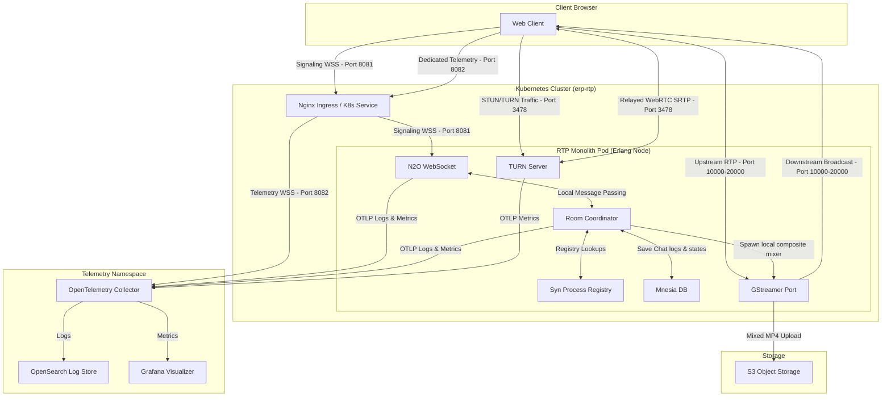

# WebRTC Group Video Conference HPA Server

This repository contains the unified, lightweight RTP monorepo designed for high-performance WebRTC
video conferencing in the SYNRC CHAT environment. It consolidates N2O WebSocket pages,
room process supervisors, Mnesia persistence, and in-process GStreamer mixer port drivers
into a single cohesive Erlang/OTP application.

## 1. Directory Blueprint

```
rtp/
├── rebar.config             # Monolith dependencies (Bandit, N2O, Nitro, KVS, Syn, Eturnal)
├── build.config             # satisfying config consultation hooks during compile
├── c_src/
│   └── gst.c                # GStreamer WebRTC compositor C99 implementation
├── config/
│   ├── sys.config           # Database directory, Eturnal TCP/UDP listeners, and N2O parameters
│   └── vm.args              # Cluster node cookie and naming args
├── src/
│   ├── rtp_app.erl          # boots KVS database, registers Syn scopes, and binds Cowboy ports
│   ├── rtp_sup.erl          # superv isor starting mnesia_srv and media_broker_srv workers
│   ├── routes.erl           # N2O page routing mappings
│   ├── login.erl            # N2O Nitro user session handler
│   ├── index.erl            # N2O Nitro room chat history feed
│   ├── room_coordinator.erl # stateful room GenServer coordinator joining/leaving participants
│   ├── syn_srv.erl          # distributed process registry wrappers
│   ├── mnesia_srv.erl       # local database schema setup (disc_copies chat and room tables)
│   ├── media_broker_srv.erl # supervised GStreamer compositor port manager (mp4 to S3 storage)
│   └── auth_translation.erl # mTLS client certificate validation and LiveKit JWT token generator
└── priv/
    ├── static/              # Front-end dashboard and client scripts
    │   ├── index.html       # dark-mode dashboard with layout controls and telemetry charts
    │   ├── client.js        # main N2O signaler client
    │   └── telemetry.js     # dedicated prioritized stats reporter querying PeerConnection stats
    └── gst                  # compiled native C99 binary spawned by Erlang port
```

## 2. Unified Architecture Topology

The simplified architecture integrates all real-time messaging, orchestration, database persistence,
and TURN capabilities into a single monolithic Erlang node, delegating layout composting and recordings
directly to local GStreamer port processes.



## 3. Technical Features

* **Zero Headless Browsers**:     Recording and compositing grid layouts is done using native GStreamer compositor port
                                  pipelines instead of Chromium-based egress, reducing resource footprint by over 90%.
* **Erlang Process Pub/Sub**:     Redis is completely removed. Signaling groups are managed in-memory across Erlang
                                  cluster nodes using Roberto Ostinelli's **`syn`** registry.
* **Persistent Mnesia Engine**:   Simplifies external databases (like RocksDB) by using built-in persistent disk tables.
                                  It writes directly to PVC paths (`/var/lib/rtp/mnesia`) or falls back to `./mnesia_data` during local development.
* **Mutual TLS (mTLS) Security**: Bypasses JWT auth keys. Ingress validates user certificates and forwards DN
                                  attributes (e.g. `CN`, `role`) as secure headers (`x-ssl-client-s-dn`, `x-ssl-client-san`) to Cowboy.
* **DSCP Telemetry Priority**:    Main signaling runs on Port `8081`. Metric diagnostics run on a secondary,
                                  dedicated connection over Port `8082`, designed for Kubernetes QoS tagging (Expedited
                                  Forwarding) to prevent metrics drops under network congestion.

## 3. Configuration & Ports

Erlang bindings and listeners are defined inside `config/sys.config`:

* **Port 8081**: Main signaling/web assets connection gateway.
* **Port 8082**: High-priority telemetry socket ingestion gateway.
* **Port 3478 (UDP/TCP)**: ProcessOne `eturnal` STUN/TURN traffic listener.
* **Mnesia Dir**: Default target is `/var/lib/rtp/mnesia` (PVC). Fallback is `./mnesia_data` if unwritable.

## 4. How to Run Locally

### 4.1 Prerequisites (macOS)

Install GStreamer tools and plugins (base, good, bad) using Homebrew:

```bash
brew install gstreamer
```

### 4.2 Start the Monolith

Due to macOS compiling NIF extensions in non-standard paths, launch the Rebar3 shell using the pre-configured script wrapper:

```bash
./rebar3 shell
```

This automatically exports OpenSSL/libyaml configurations, compiles the codebase, and launches the VM:

```erlang
===> Booted eturnal
===> Booted mnesia
===> Booted rtp
```

Once booted, access the video interface at `http://localhost:8081/app/login.htm`.

## 5. Media Pipeline Architecture and Delivery Nuances

The system employs an advanced, multi-modal GStreamer pipeline capable of synthesizing grid-composited media from real-time WebRTC ingest and demultiplexing it to heterogeneous endpoints. The architecture natively supports three distinct fragmentation and streaming topologies tailored to varied latency and browser compatibility constraints.

### 5.1 Fragmented Streaming Topologies

#### 1. Fragmented MP4 (fMP4)
- **Mechanism:** The pipeline generates a single, continuously growing `recording.mp4` file encoded via `x264enc`.
- **Packaging:** Handled by `mp4mux` with `fragment-duration=1000` and `streamable=true`. This avoids building a massive Moov atom at the end of the file and interleaves Moof (Movie Fragment) and Mdat (Media Data) atoms sequentially.
- **Delivery Characteristics:** Suitable for environments requiring unified file storage while still supporting progressive HTTP download. However, the lack of definitive manifest metadata natively prevents clients from dynamically adapting to shifting live edge bounds, making it less optimal for robust Live streaming.

#### 2. MPEG-TS (H.264 / AAC)
- **Mechanism:** The pipeline leverages `hlssink2` to generate discrete 2-second Transport Stream (`.ts`) segments accompanied by a dynamically updating `index.m3u8` playlist.
- **Packaging:** Encoded using the ubiquitous H.264 (`x264enc`) and AAC codecs, guaranteeing maximal compatibility across legacy and modern web environments.
- **Delivery Characteristics:** Operates as the default robust fallback. By utilizing `target-duration=2` and `playlist-length=10`, the system maintains a 20-second rolling buffer. This generous buffer window absorbs network transmission jitter and encoder processing variance, ensuring contiguous client-side playback.

#### 3. HEVC (H.265 / AAC)
- **Mechanism:** An experimental high-efficiency tier utilizing `x265enc` exclusively for the HLS storage/delivery path.
- **Packaging:** Due to limited browser support for WebRTC over H.265, the pipeline executes a *dual-encoding* strategy. The composited raw video is teed (`raw_vtee`); one branch proceeds to an H.264 encoder to sustain real-time WebRTC participant feeds, while the second branch proceeds to an H.265 encoder targeting the `hlssink2` destination.
- **Delivery Characteristics:** Provides substantially improved visual fidelity at equivalent bitrates or bandwidth conservation at equivalent quality. Delivery targets modern ecosystems (e.g., Apple Safari/iOS) capable of natively decoding H.265 TS segments.

### 5.2 Nuances of Live HLS Delivery and Caching Pathologies

Delivering micro-segmented live HLS playlists (`index.m3u8`) over a standard web server introduces critical HTTP caching pathologies that severely degrade playback continuity.

- **The ETag Stalling Phenomenon:** Modern static web servers (such as Elixir's `Plug.Static`) utilize `ETag` headers or `Last-Modified` timestamps to negotiate cache revalidation (HTTP 304 Not Modified). In a live HLS context where `target-duration` is short (e.g., 2 seconds) and the `playlist-length` is fixed (e.g., 10 segments), the `index.m3u8` file frequently maintains identical byte sizes across successive updates. If an update occurs within the 1-second truncation threshold of standard filesystem `mtime` resolutions, the web server heuristically concludes the file has not mutated.
- **Client Starvation:** When `hls.js` attempts to poll the playlist to discover the next sequential `.ts` segment, the web server replies with `304 Not Modified`. The player is deceived into believing no new segments exist, rapidly exhausting its internal buffer and resulting in a hard stall.
- **The Absolute No-Store Intervention:** To mathematically guarantee playlist freshness, the routing architecture explicitly intercepts `.m3u8` requests prior to static file evaluation (via `Rtp.LiveStream`). The handler deliberately strips all `ETag` generation capabilities, forcibly embeds aggressive cache-busting directives (`Cache-Control: no-store, no-cache, must-revalidate, max-age=0`), and serves the raw file binaries. This circumvents the HTTP revalidation cycle entirely, ensuring deterministic delivery of the live edge state.
