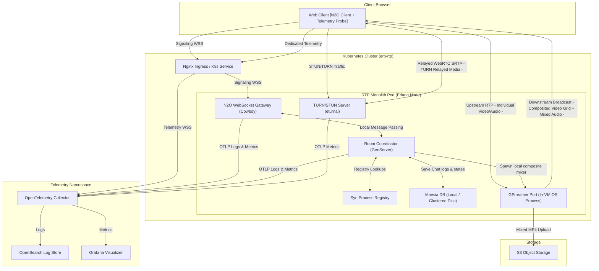

# УАК ВЗ: Monolithic WebRTC Video Conference Gateway

This repository contains the unified, lightweight RTP monorepo designed for high-performance WebRTC
video conferencing in the SYNRC CHAT environment. It consolidates N2O WebSocket pages,
room process supervisors, Mnesia persistence, and in-process GStreamer mixer port drivers
into a single cohesive Erlang/OTP application.

---

## 1. Directory Blueprint

```
rtp/
├── rebar.config             # Monolith dependencies (Cowboy, N2O, Nitro, KVS, Syn, Eturnal)
├── run.sh                   # macOS developer startup script (exports OpenSSL/libyaml CFLAGS)
├── build.config             # satisfying config consultation hooks during compile
├── config/
│   ├── sys.config           # Database directory, Eturnal TCP/UDP listeners, and N2O parameters
│   └── vm.args              # Cluster node cookie and naming args
├── src/
│   ├── rtp_app.erl          # boots KVS database, registers Syn scopes, and binds Cowboy ports
│   ├── rtp_sup.erl          # superv isor starting mnesia_srv and media_broker_srv workers
│   ├── routes.erl           # N2O page routing mappings
│   ├── login.erl            # N2O Nitro user session handler
│   ├── index.erl            # N2O Nitro room chat history feed
│   ├── room_coordinator.erl # stateful room GenServer coordinator joining/leaving participants
│   ├── syn_srv.erl          # distributed process registry wrappers
│   ├── mnesia_srv.erl       # local database schema setup (disc_copies chat and room tables)
│   ├── media_broker_srv.erl # supervised GStreamer compositor port manager (mp4 to S3 storage)
│   └── auth_translation.erl # mTLS client certificate validation and LiveKit JWT token generator
└── priv/
    ├── static/              # Front-end dashboard and client scripts
    │   ├── index.html       # dark-mode dashboard with layout controls and telemetry charts
    │   ├── client.js        # main N2O signaler client
    │   └── telemetry.js     # dedicated prioritized stats reporter querying PeerConnection stats
    ├── gst_recorder.c       # GStreamer WebRTC compositor C99 implementation
    └── gst_recorder         # compiled native C99 binary spawned by Erlang port
```

---

## 2. Unified Architecture Topology

The simplified architecture integrates all real-time messaging, orchestration, database persistence,
and TURN capabilities into a single monolithic Erlang node, delegating layout composting and recordings
directly to local GStreamer port processes.



---

## 3. Technical Features

* **Zero Headless Browsers**:     Recording and compositing grid layouts is done using native GStreamer compositor port
                                  pipelines instead of Chromium-based egress, reducing resource footprint by over 90%.
* **Erlang Process Pub/Sub**:     Redis is completely removed. Signaling groups are managed in-memory across Erlang
                                  cluster nodes using Roberto Ostinelli's **`syn`** registry.
* **Persistent Mnesia Engine**:   Simplifies external databases (like RocksDB) by using built-in persistent disk tables.
                                  It writes directly to PVC paths (`/var/lib/rtp/mnesia`) or falls back to `./mnesia_data` during local development.
* **Mutual TLS (mTLS) Security**: Bypasses JWT auth keys. Ingress validates user certificates and forwards DN
                                  attributes (e.g. `CN`, `role`) as secure headers (`x-ssl-client-s-dn`, `x-ssl-client-san`) to Cowboy.
* **DSCP Telemetry Priority**:    Main signaling runs on Port `8081`. Metric diagnostics run on a secondary,
                                  dedicated connection over Port `8082`, designed for Kubernetes QoS tagging (Expedited
                                  Forwarding) to prevent metrics drops under network congestion.

## 3. Configuration & Ports

Erlang bindings and listeners are defined inside `config/sys.config`:
* **Port 8081**: Main signaling/web assets connection gateway.
* **Port 8082**: High-priority telemetry socket ingestion gateway.
* **Port 3478 (UDP/TCP)**: ProcessOne `eturnal` STUN/TURN traffic listener.
* **Mnesia Dir**: Default target is `/var/lib/rtp/mnesia` (PVC). Fallback is `./mnesia_data` if unwritable.

---

## 4. How to Run Locally

### 4.1 Prerequisites (macOS)
Install GStreamer tools and plugins (base, good, bad) using Homebrew:
```bash
brew install gstreamer
```

### 4.2 Start the Monolith
Due to macOS compiling NIF extensions in non-standard paths, launch the Rebar3 shell using the pre-configured script wrapper:
```bash
./run.sh
```
This automatically exports OpenSSL/libyaml configurations, compiles the codebase, and launches the VM:
```erlang
===> Booted eturnal
===> Booted mnesia
===> Booted rtp
```
Once booted, access the video interface at `http://localhost:8081/app/login.htm`.
