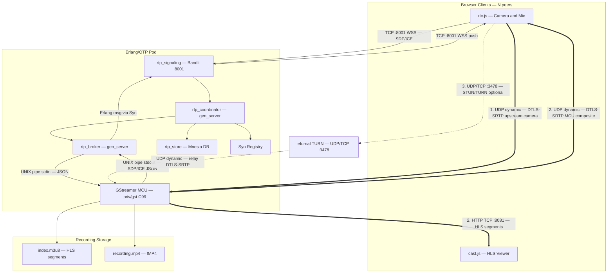

# WebRTC Group Video Conference HPA Server

[](https://github.com/zencrypted/rtp/actions)
[](https://hex.pm/packages/rtp)

This repository contains the unified, lightweight RTP monorepo designed for high-performance
WebRTC video conferencing. It consolidates N2O WebSocket signaling pages, session authentication,
room process supervisors, Mnesia persistence, and in-process GStreamer compositor port drivers
into a single cohesive Erlang/OTP application.

## 1. Source Tree Directory Blueprint

```
├── c_src/
│   └── gst.c                    # GStreamer WebRTC MCU compositor — C99, 668 lines
├── include/
│   └── rtp_token.hrl            # rtp_token record: token, user, room, device, expiry
├── config/
│   ├── config.exs               # Elixir/OTP application environment
│   ├── sys.config               # Mnesia dir, N2O parameters, port bindings
│   └── vm.args                  # Cluster node cookie and naming arguments
├── priv/
│   ├── cert.sh                  # X.509 Cert Generator script
│   ├── cert.pem                 # X.509 Certificate PEM
│   ├── key.pem                  # X.509 Private Key PEM
│   ├── gst                      # Compiled native C99 binary spawned by Erlang port
│   └── static/
│       ├── app/
│       │   ├── index.htm        # Conference participant page (WebRTC + N2O chat)
│       │   ├── bcast.htm        # HLS broadcast viewer page (passive observer)
│       │   └── login.htm        # Session login page
│       ├── js/
│       │   ├── rtc.js           # WebRTC signaling client: peer connection, SDP/ICE, telemetry
│       │   └── cast.js          # HLS broadcast viewer: hls.js player, retro/live seek, telemetry
│       └── css/
│           ├── blank.css        # Base Synrc CSS Layer
│           └── color.css        # Custom Synrc CSS Layer
├── lib/
│   ├── hls.ex                   # HTTP Live Streaming handler — strips ETag, forces no-store
│   ├── n2o.ex                   # RTP.N2O <-> Bandit WebSocket proxy
│   ├── static.ex                # Plug.Static asset server (port 8081) - routes to RTP.N2O
│   └── ws.ex                    # WebSocket server (port 8001) — routes to rtp_signaling
├── src/
│   ├── rtp_private.erl          # N2O Nitro page: p2p chat history, file upload
│   ├── rtp_room.erl             # N2O Nitro page: room chat history, member list, file upload
│   ├── rtp_login.erl            # N2O Nitro page: session token issuance and redirect
│   ├── rtp_broker.erl           # gen_server: GStreamer port lifecycle and Port IPC bridge
│   ├── rtp_store.erl            # gen_server: Mnesia schema init, per-room chat tables
│   ├── rtp_signaling.erl        # WebSock handler: SDP/ICE signaling, peer registration
│   ├── rtp_coordinator.erl      # gen_server: room state, participant presence, media delegation
│   ├── rtp_routes.erl           # N2O URL router: /app/index.htm → index, /app/login.htm → login
│   ├── rtp_app.erl              # OTP Application: listeners, Syn scopes, session table, banner
│   ├── rtp_sup.erl              # OTP Supervisor (one_for_one): rtp_store worker
│   ├── rtp_syn.erl              # N2O MQ backend: wraps Syn v3 pub/sub as N2O pool registry
│   ├── rtp.app.src              # Application descriptor and dependency list
│   └── rtp_token.erl            # ETS-backed session token: issue, validate, update_device
├── mix.exs                      # Elixir package manager (Hex dependencies)
├── rebar.config                 # Rebar3 build configuration
├── GST.md                       # GStreamer MCU compositor specification
├── README.md                    # SYNRC RTP Erlang/OTP application passport
├── index.html                   # HTML version of RTP passport
├── gst-nuttx.pdf                # GStreamer MCU port to NuttX RTOS (article)
└── rtp.pdf                      # RTP MCU Gateway article (LaTeX)
```

## 2. System Architecture

The system is organized into three distinct layers: the browser client (SPA), the
Erlang/OTP control plane, and the C99 GStreamer media plane. All participants of a
given room are bound to the same Erlang node via Ingress sticky sessions, eliminating
inter-node cluster traffic and allowing the system to scale horizontally as a set of
share-nothing pods.



### 2.1 Conferencing Topology: MCU Model

Unlike Selective Forwarding Units (SFU), which route $K-1$ independent streams to each
participant (requiring each browser to decode $K-1$ feeds simultaneously), the system
enforces a centralized MCU model. The GStreamer compositor decodes all upstream feeds,
composites them into a single 1920 × 1080 grid, re-encodes the composite, and broadcasts
a **single stream** to every participant. This ensures O(1) bandwidth and decoding
complexity at the client, independent of the number of active participants.

### 2.2 Control Plane Separation of Concerns

The Erlang/OTP control plane strictly decouples connection management, logical room state,
and media processing into three distinct layers. This separation ensures fault isolation,
predictable latency, and granular crash recovery:

1. **Signaling** `rtp_signaling`: Maps 1:1 to an active WebSocket connection.
   It acts as the edge protocol translator, converting JSON SDP/ICE messages
   from the browser into internal Erlang messages. If a client sends malformed
   data or drops the TCP connection ungracefully, only this isolated process terminates,
   leaving the rest of the room unaffected.

2. **Coordinator** `rtp_coordinator`: The pure domain-logic hub, mapping 1:1 to a conference room.
   It manages the participant list, presence broadcasts, and chat routing.
   By keeping it free from heavy I/O and OS process management,
   the coordinator maintains extremely low latency and high stability.
   It serves as the source of truth for the room.

3. **Broker** `rtp_broker`: The perilous boundary layer interfacing with the C99 GStreamer media pipeline.
   Managing external OS processes via Erlang Ports involves handling unpredictable `stdout` chunking, buffering,
   and potential C-level crashes. The broker isolates this risk. If the C pipeline segfaults or the IPC
   pipe backs up, the broker can absorb the crash or block without freezing the room coordinator,
   allowing for graceful media recovery while text chat and presence remain fully operational.

## 3. Erlang/OTP Module Descriptions

### 3.1 Application Bootstrap — `rtp_app.erl`

`rtp_app` implements the `application` behaviour. On start it:

1. Configures N2O: port `8001`, protocols `[nitro_n2o, n2o_heart]`, MQ backend `rtp_syn`.
2. Calls `kvs:join()` to initialize the KVS schema layer.
3. Calls `rtp_token:init_table()` to create the ETS session store.
4. Registers the `rooms` and `n2o_mq` Syn scopes via `syn:add_node_to_scopes/1`.
5. Spawns two Bandit listeners: WebSocket on port `8001`, static assets on port `8081`.
6. Starts `rtp_sup`.

The startup banner reports hardware capacity heuristics:

* `MaxRooms = logical_cores × 10`
* `RoomCapacity = 50` participants per room
* `MaxParticipants = MaxRooms × RoomCapacity`

### 3.2 Supervisor — `rtp_sup.erl`

`one_for_one` strategy with intensity `5` / period `10`. Supervises a single
permanent worker: `rtp_store`. Room coordinators and media brokers are started
transiently on-demand by `rtp_coordinator:ensure_started/1`.

### 3.3 Session Authentication — `rtp_token.erl`

```erlang
-record(rtp_token, {
    token  :: binary(),             % Unique opaque session token
    user   :: binary(),             % Username
    room   :: binary(),             % Room name
    device :: binary() | undefined, % WebRTC peer_id (populated on WebSocket connect)
    expiry :: integer()             % Gregorian seconds expiry (issue time + 180 s)
}).
```

Token lifecycle:

* `issue(User, Room)` — generates a cryptographic token via `n2o_secret:sid/1`,
  stores the record in the `rtp_tokens` ETS table with a 3-minute TTL.
* `validate(Token)` — looks up the ETS table, rejects expired entries and removes them.
* `update_device(Token, PeerId)` — associates the ephemeral WebRTC `peer_id` with
  the session on first WebSocket connection.

### 3.4 WebSocket Signaling — `rtp_signaling.erl`

Implements the `Elixir.WebSock` behaviour. State record:

```erlang
-record(state, {
    user_id  :: binary(),
    room_id  :: binary(),
    role     :: binary(),
    peer_id  :: binary(),   % peer_<unique_integer>
    room_pid :: pid()
}).
```

`init/1`: Generates a unique `peer_id`, ensures the `rtp_coordinator` is started,
updates the session token device field, registers the process in the `rooms` Syn scope
(`syn:register(rooms, PeerId, self())`), and sends `send_init_msg` to itself.

`handle_in/2`: Decodes JSON text frames and dispatches:

| Client Message | Handler Action |
|---|---|
| `{"type":"ready"}` | Calls `rtp_coordinator:originate_video/3` — triggers GStreamer peer join |
| `{"type":"get_room_info"}` | Retrieves `started_at` from broker; pushes `room_info` |
| `{"type":"get_peers"}` | Retrieves peer list from broker; pushes `peer_list` |
| `{"type":"ping"}` | No-op keep-alive |
| `{"sdp":{"type":"answer","sdp":...}}` | Forwards SDP answer to `rtp_coordinator` |
| `{"candidate":...}` | Forwards ICE candidate to `rtp_coordinator` |

`handle_info/2`: Routes Erlang messages to WebSocket pushes:

| Erlang Message | WebSocket Push |
|---|---|
| `send_init_msg` | `{"type":"init","peer_id":"..."}` |
| `{send_room_info, At}` | `{"type":"room_info","started_at":...,"hls_format":...}` |
| `{sdp_offer, Sdp}` | `{"sdp":{"type":"offer","sdp":"..."}}` |
| `{ice_candidate, Cand}` | `{"candidate":{...}}` |
| `{peer_joined, PeerId}` | `{"type":"peer_joined","peer_id":"..."}` |
| `{peer_left, PeerId}` | `{"type":"peer_left","peer_id":"..."}` |

`terminate/2`: Calls `rtp_coordinator:peer_left/2` and unregisters from Syn.

### 3.5 Room Coordinator — `rtp_coordinator.erl`

A per-room `gen_server` started on-demand by `ensure_started/1`. It is registered
in the `rooms` Syn scope under the binary room ID. State record:

```erlang
-record(state, {
    room_id      :: binary(),
    participants = []         :: list(),     % Active member maps: #{id, pid}
    publishers   = []         :: list(),     % Active media publishers
    media_broker = undefined  :: pid() | undefined
}).
```

Handles:

| Call / Cast | Behaviour |
|---|---|
| `{join, Participant}` | Adds participant; publishes `{presence, join, Participant}` via Syn |
| `{leave, ParticipantId}` | Removes participant; publishes `{presence, leave, ParticipantId}` |
| `{chat, Sender, Message}` | Writes to Mnesia via `rtp_store`; via `n2o:send/2` |
| `{start_video, Peer, Client}` | Lazily starts `rtp_broker`; calls `peer_joined/4` |
| `{sdp_answer, PeerId, Sdp}` | Delegates to `rtp_broker:sdp_answer/4` |
| `{ice_candidate, PeerId, Cand}` | Delegates to `rtp_broker:ice_candidate/4` |
| `{peer_left, PeerId}` | Delegates to `rtp_broker:peer_left/3` |
| `terminate_room` | Calls `rtp_broker:terminate_room/2`; stops broker |
| `get_started_at` | Queries broker for recording start timestamp |
| `get_peers` | Queries broker for active peer list |

On `terminate/2`, unregisters from Syn and stops the media broker if active.

### 3.6 Media Broker — `rtp_broker.erl`

A per-room-group `gen_server` managing the GStreamer port process lifecycle. State:

```erlang
-record(state, {
    ports         = #{},  % RoomId → Port
    room_peers    = #{},  % RoomId → [PeerId]
    peer_rooms    = #{},  % PeerId → RoomId
    room_started_at = #{}, % RoomId → millisecond timestamp
    monitors      = #{}   % MonitorRef → {RoomId, PeerId}
}).
```

**Port spawning** (`peer_joined` call): On the first peer join for a room, spawns
the `priv/gst` binary as an Erlang port with:
```erlang
open_port({spawn_executable, Binary}, [
    binary, stream, {args, [OutDir, FormatStr]},
    use_stdio, stderr_to_stdout, exit_status,
    {line, 16384},
    {env, [{"GST_GL_WINDOW", "none"},
           {"GST_PLUGIN_FEATURE_FILTER", "opengl:0,applemedia:0"}]}
])
```

**Port IPC** (`send_to_port/2`): Encodes Erlang maps as JSON via `jsone:encode/1`
and writes to the port with a trailing newline.

**Stdout parsing** (`handle_info({Port, {data, {eol, Line}}}, ...)`): Decodes JSON
lines received from the GStreamer process and dispatches:

| GStreamer Output | Erlang Action |
|---|---|
| `{"type":"sdp_offer","peer_id":"...","sdp":"..."}` | Sends `{sdp_offer, Sdp}` to the peer's signaling process via `syn:lookup` |
| `{"type":"ice_candidate","peer_id":"...","candidate":{...}}` | Sends `{ice_candidate, Candidate}` to the peer's signaling process |
| `{"type":"recording_started"}` | Records real start time; begins polling for `index.m3u8` manifest |

**Manifest polling** (`poll_manifest`): After `recording_started`, polls
`priv/static/rooms/<id>/index.m3u8` every 100 ms (up to 1000 attempts / 100 seconds).
When the manifest appears on disk, broadcasts `room_info` to all room peers via Syn.

**Process monitoring**: On `peer_joined`, monitors the client WebSocket process PID.
If the process dies (browser tab closed, network drop), the `'DOWN'` message triggers
`handle_peer_departure`, cleanly notifying GStreamer and updating room state.

**Last-peer cleanup**: When `handle_peer_departure` reduces the room peer list to
empty, the port is closed (`catch port_close(Port)`), automatically terminating
the GStreamer process and freeing media resources.

### 3.7 Persistence — `rtp_store.erl`

A named `gen_server` (singleton) initializing Mnesia on startup. Schema:

| Table | Type | Key | Fields |
|---|---|---|---|
| `chat_message` | `ordered_set`, `disc_copies` | `{room_id, timestamp}` | `room_id`, `sender`, `text` |
| `room_state` | `set`, `disc_copies` | `room_id` | `state_data` |
| `chat_room_<RoomId>` | `ordered_set`, `disc_copies` | `{room_id, timestamp}` | per-room chat partition |

Per-room tables (`create_room_table/1`) are created lazily when a room coordinator
starts, enabling namespace-level partitioning of chat history across rooms.

### 3.8 Pub/Sub Backend — `rtp_syn.erl`

Implements the N2O MQ interface backed by Syn v3, replacing Redis:

```erlang
send(Pool, Message) ->
    syn:publish(n2o_mq, term_to_binary(Pool), Message).

reg(Pool, _Value) ->
    syn:join(n2o_mq, term_to_binary(Pool), self()).
```

This provides in-memory, distributed-optional pub/sub for N2O page events
(chat messages, member presence) without any external message broker dependency.

### 3.9 URL Router — `rtp_routes.erl`

N2O router implementing `init/2` and `finish/2`. Maps HTTP path prefixes to
Erlang page modules:

| Path prefix | Module |
|---|---|
| `/` or `` | `rtp_login` |
| `/ws/index...` or `/app/index...` | `rtp_room` |
| `/ws/login...` or `/app/login...` | `rtp_login` |

### 3.10 Login Page — `rtp_login.erl`

N2O Nitro page. The `login` event:

1. Reads `user` and `pass` (room name) form fields via `nitro:q/1`.
2. Issues a session token via `rtp_token:issue/2`.
3. Stores user and token in the N2O session.
4. Writes `localStorage.setItem('rtp_joined', 'true')` via `nitro:wire/1`.
5. Redirects to `/app/index.htm?room=<room>&user=<user>&token=<token>`.

### 3.11 Index Page — `rtp_room.erl`

N2O Nitro page serving the conference room interface. The `init` event:

1. Validates the session token from URL params or session store.
2. Registers the process on the room topic (`n2o:reg({topic, Room})`).
3. Renders the logout button, room heading, chat send button, upload widget, and
   terminate button.
4. Calls `rtp_coordinator:ensure_started/1` and `rtp_coordinator:join/2`.
5. Loads chat history from Mnesia and renders message elements.
6. Renders the active participants list via injected JavaScript.
7. Broadcasts `{member_joined, User}` to the room topic.

## 4. Frontend Modules

### 4.1 Conference Client — `priv/static/js/rtc.js`

Manages the full WebRTC participant lifecycle within `index.htm`:

- **Session persistence**: Room, user, and token are read from URL params with
  `localStorage` fallback, enabling F5 resume without re-authentication.
- **Signaling**: Connects to `ws://<host>:8001/ws/signaling?room=...&user=...&token=...`.
  Handles `init`, `room_info`, `sdp` (offer), and `candidate` messages.
- **`startConference()`**: Acquires `getUserMedia` (video 640×360/30fps + audio,
  with audio-only fallback), creates `RTCPeerConnection`, adds tracks, and sends
  `{"type":"ready"}` to trigger GStreamer peer join.
- **`leaveConference()`**: Closes WebSocket, stops tracks, resets PeerConnection,
  clears `localStorage.rtp_joined`.
- **Telemetry**: Polls `RTCPeerConnection.getStats()` every 2 seconds and displays
  RTT (ms) and packet loss (%) from `remote-inbound-rtp` and `candidate-pair` reports.
- **Autoplay handling**: On `NotAllowedError` from `video.play()`, injects a
  click-to-play overlay button.

### 4.2 Broadcast Viewer — `priv/static/js/cast.js`

Manages HLS passive viewer playback within `bcast.htm`:

- **HLS player**: Uses `hls.js` with `liveSyncDurationCount=2`, `backBufferLength=30`.
  Loads `playlist-location=/rooms/<room>/index.m3u8`.
- **Live/Retro mode**: Detects scrubbing via `retroSlider` and toggles between LIVE
  (pulsing red dot) and RETRO (grey dot) states. Automatic catch-up logic jumps to
  `liveSyncPosition` when drift exceeds 10 seconds.
- **Error recovery**: Network errors reload the playlist source after 1 second;
  media errors call `recoverMediaError()`; fatal errors destroy and reinitialize
  the player after 2 seconds.
- **Stream end (VOD mode)**: On `video.ended`, disables catch-up, changes badge
  to "ЗАВЕРШЕНО", and treats the stream as a playable archive.
- **Telemetry sidebar**: WebSocket connection to the signaling server for receiving
  `peer_joined` / `peer_left` events and displaying active peer count and list.
- **Stall detection**: 5-second `waiting` event timeout triggers full player
  reinitialization.

## 5. Media Pipeline Architecture

### 5.1 Static Pipeline Structure

The GStreamer pipeline (`c_src/gst.c`) maintains a permanent backbone activated at
startup: a black `videotestsrc` feeds `compositor.sink_0` and a silent `audiotestsrc`
feeds `audiomixer.sink_0`. This prevents scheduler stalls when no peers are connected.

Three output formats are supported, selected by the `hls_format` application environment:

| Format | Video Encoder | Audio Encoder | Sink |
|---|---|---|---|
| `ts` (default) | x264enc → h264parse → rtph264pay / hlssink2 | opusenc (WebRTC) + avenc_aac (HLS) | `hlssink2` (2s segments, `playlist-length=10`) |
| `fmp4` / `mp4` | x264enc → h264parse → rtph264pay / mp4mux | opusenc (WebRTC) + avenc_aac (mux) | `mp4mux fragment-duration=1000 streamable=true` |
| `hevc` / `h265` | x264enc (WebRTC) + x265enc (HLS) | opusenc (WebRTC) + avenc_aac (HLS) | `hlssink2` with H.265 video |

### 5.2 HLS Caching Pathology and the No-Store Intervention

Standard static file servers use `ETag` / `Last-Modified` headers for cache
revalidation. In an HLS context where `index.m3u8` is updated every 2 seconds
but may retain identical byte sizes across successive updates, servers return
`304 Not Modified`, starving `hls.js` of new segment announcements and causing
hard playback stalls.

`Rtp.LiveStream` (Elixir) intercepts all `.m3u8` requests before `Plug.Static`
evaluation, stripping ETag generation and injecting:

```
Cache-Control: no-store, no-cache, must-revalidate, max-age=0
```

This guarantees deterministic delivery of the live edge state on every poll.

### 5.3 PTS/DTS Integrity: Direct-to-Sink Tee Branching

Earlier iterations routed H.264 through `rtph264pay → rtph264depay` before feeding
`hlssink2`. The RTP payload/depayload cycle introduces microscopic PTS/DTS
discontinuities that `mpegtsmux` cannot tolerate, causing MSE decoders to freeze.

The corrected architecture tees the stream *after* `h264parse` (and *before*
`rtph264pay`), sending a pristine bitstream directly to `hlssink2` while a separate
branch handles RTP payloading for WebRTC participants. Audio is teed from the raw
`audiomixer` output (`raw_atee`) before the Opus encoder, preserving timestamps for
both paths independently.

### 5.4 Disk-I/O Isolation: 30-Second Leaky Queues

HLS segment writes (approx. 1 MB per 2-second `.ts` segment) introduce I/O stalls
that, under standard 1.2-second queue limits, cause upstream frame drops. Storage
branches use `queue max-size-time=30000000000 leaky=2` (30 s). Frames accumulate
in RAM during filesystem stalls, mathematically guaranteeing HLS continuity
independent of disk scheduler latency.

## 6. Configuration and Ports

| Port | Protocol | Purpose |
|---|---|---|
| `8001` | WebSocket (Bandit) | N2O signaling + WebRTC SDP/ICE signaling |
| `8081` | HTTP (Bandit) | Static file server (`Plug.Static`) for `priv/static/` |
| `3478` | UDP/TCP (eturnal) | STUN/TURN relay for NAT traversal |
| `5349` | UDP/TCP (eturnal) | TURNS (STUN/TURN over TLS) |

Mnesia directory defaults to `/var/lib/rtp/mnesia` (Kubernetes PVC) with
fallback to `./mnesia_data` for local development.

## 7. How to Run Locally

### 7.1 Prerequisites (macOS)

```bash
brew install gstreamer libnice libnice-gstreamer json-glib erlang
```

### 7.2 Prerequisites (Ubuntu / WSL2)

```bash
sudo apt-get update
sudo apt-get install -y libgstreamer1.0-dev libgstreamer-plugins-base1.0-dev libgstreamer-plugins-bad1.0-dev libjson-glib-dev pkg-config
```

### 7.3 Compile the GStreamer Binary

```bash
cc -O3 c_src/gst.c -o priv/gst \
  $(pkg-config --cflags --libs \
    gstreamer-1.0 gstreamer-webrtc-1.0 gstreamer-sdp-1.0 json-glib-1.0)
```

### 7.4 Start the Monolith

```bash
iex -S mix
```

Expected banner:

```
╔════════════════════════════════════════════════════════╗
║  ERP/1: RTP Server / Signaling & Telemetry             ║
║  WS  : ws://localhost:8001/ws/app/<page>.htm           ║
║  HTTP: http://localhost:8081/app/login.htm             ║
╚════════════════════════════════════════════════════════╝
  Hardware   : 10 Cores, 16 GB RAM
  Max Rooms  : 100 (heuristic based on cores)
  Capacity   : 5000 max participants (50 per room)
  RTP Codecs : Opus (Audio), VP8, VP9, H.264 (Video)
```

### 7.5 Access the Interface

Navigate to `http://localhost:8081/app/login.htm`. Enter a username and room name.
The login page issues a 3-minute session token and redirects to the conference page.

## 8. ITU-T Standards Alignment

| Standard | Description | System Mapping |
|---|---|---|
| H.264 | Active video codec (AVC) | `x264enc` in `gst.c` (WebRTC + HLS) |
| H.265 | High-efficiency video codec (HEVC) | `x265enc` in `gst.c` (HEVC HLS pipeline) |
| H.323 | Packet multimedia systems | `rtp_coordinator` architecture mirrors H.323 MCU |
| H.235.8 | SRTP key exchange via secure signaling | DTLS-SRTP negotiated by `webrtcbin` |
| H.239 | Role management (participant/presenter) | `role` field in `rtp_signaling` state |
| H.245 | Control protocol for multimedia | SDP in WebRTC (RFC 8866 / RFC 3264) |
| G.711 | PCM 64 kbit/s | WebRTC baseline audio |
| G.722 | 7 kHz wideband | WebRTC HD voice |
| T.124 | Generic conference control | `rtp_coordinator` gen_server |
| X.601 | Multi-peer communications framework | N2O WebSocket + Syn room scope |
| X.603 | Relayed multicast protocol | Erlang Port IPC (stdin/stdout relay) |

## 9. Articles

* M. Sokhatsky. *RTP: A Minimal MCU Gateway of ANSI C99 with GStreamer for High-Density
  Video Conferencing on Erlang/OTP Control Plane in Alpine Linux under Kubernetes
  (Part of Zen Crypted X.422.2 Buddha Protocol)*. Axiosis. 2026. ([rtp.pdf](rtp.pdf))

* M. Sokhatsky. *NuStream: A Lightweight, Predictable Deterministic Real-Time Media
  Pipeline with GStreamer-like API for NuttX RTOS*. Axiosis. 2026. ([gst-nuttx.pdf](gst-nuttx.pdf))

## 10. Credits

* Ericsson Research — First GStreamer WebRTC implementation (OpenWebRTC)
* 5HT — Author of SYNRC RTP
